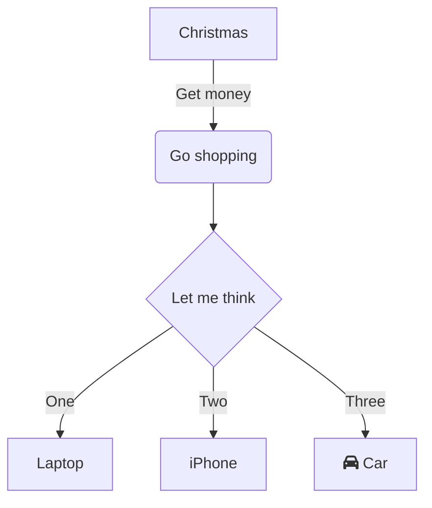

# Démo complète

Présentation générée avec **Marp**

---
## Diagram

--- 
### Inline

$E = mc^2$  
$E = mc^3$  
$E = mc^4$

---

### Bloc

$$
\int_0^\infty e^{-x^2} \, dx
$$

---

 
ayuzfgazyufyugyuoaifzjnioazfjnio
<pre class="mermaid" style="font-size: 24px;">
mindmap
  root((mindmap))
    Origins
      Long history
      ::icon(fa fa-book)
      Popularisation
        British popular psychology author Tony Buzan
    Research
      On effectiveness and features
      On Automatic creation
        Uses
            Creative techniques
            Strategic planning
            Argument mapping
    Tools
      Pen and paper
      Mermaid
</pre> 

